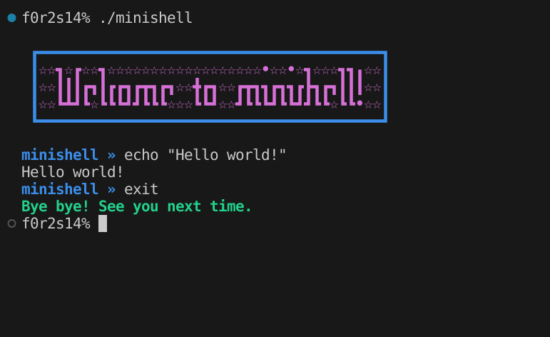

<div align="center">
  
  <p>Creating a simple version of Bash.</p>
</div>

# About the project

A project made in accordance with the Minishell project which is part of the Codam Core Curriculum. This project was a collaboration between [FeliciaCodes](https://github.com/fkoolhoven) and [Jagna Hendriks](https://github.com/jshendriks).
We created our own simple version of bash, Jagna handling the executer, environment and signals and Felicia handling the tokenizer, expander and parser. Our Minishell contains several builtins, handles redirections (including heredocs), pipes, several signals. It expands environment variables (or attempts to)
when it finds a $ but distinguishes between single (') and double (") quotes, not interpreting $ when it is between double quotes. This was the biggest collaborative project we had both worked on until that point. 


# Getting started

Start by cloning the repository:
```c
git clone https://github.com/fkoolhoven/Minishell
```
Go into the minishell directory and compile by using make:
```c
make
```
If you are not on Linux you might need to make some changes to the Makefile, in particular the flags.

# Usage



You can use Minishell like you would use Bash.

For example:
```c
<< EOF grep "Hello world" | wc > outfile 
```
will work the same as in Bash. Minishell handles <<, <, >, >> as redirections and | as pipe.

Minishell also has several builtins (see src/builtins) so
```c
export var="Hello world"
```
will add var to the environment variables.

And because we also handle $, single and double quotes
```c
echo "$USER" '$USER'
```
will output: [yourusername] $USER

Available signals:
- ctrl-C displays a new prompt on a new line
- ctrl-D exits the shell
- ctrl-\ does nothing

Minishell also has a working history (use the arrow keys).

# Important learnings

We worked together for several weeks on this project and got a lot of practice in with things we were already familiar with + we were introduced to some new topics.

1. Working together on a complex project, deciding on a stategy together and communicating about challenges
2. Using Git and GitHub in a collaborative way
3. Implementing our own hash table to store the environment variables
4. Writing an elaborate tokenizer / parser that interprets user input in a way that can be used by an executer 
5. Preventing memory leaks in a large project
6. Implementing signals
7. Parent and child processes
8. Linked lists
9. File descriptors
10. Exit codes and handling errors

# Contact

See our profile pages for ways to contact us!
